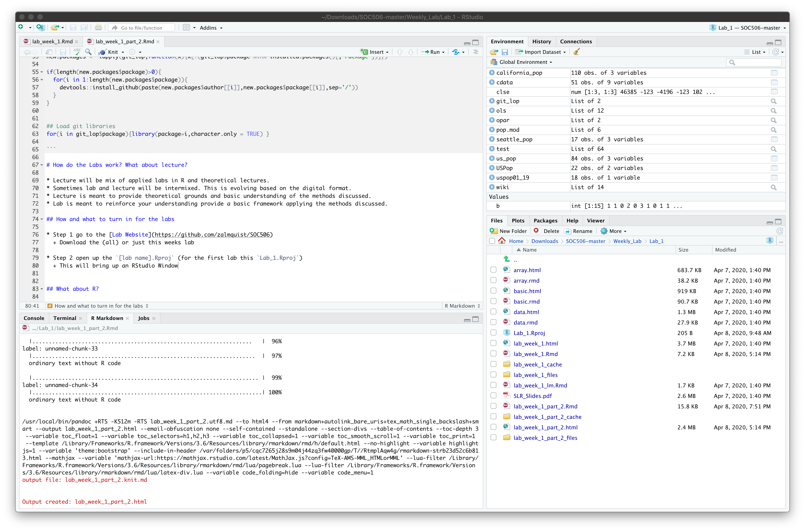
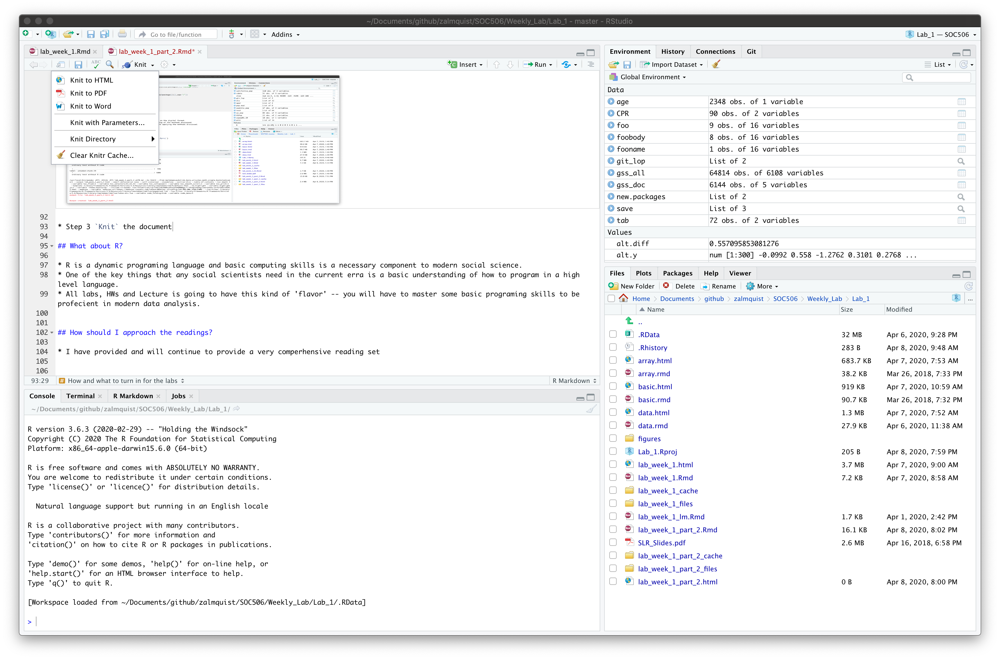
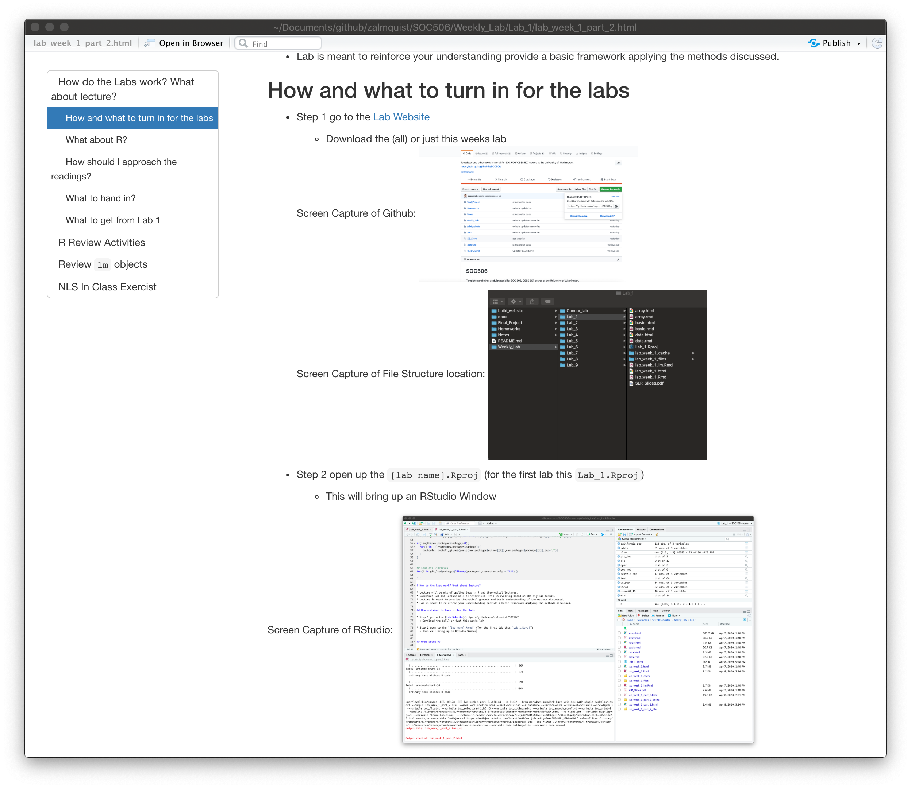

```{r setup, include=FALSE}
## Set knitr options here
knitr::opts_chunk$set(echo = TRUE,
                      comment = NA, 
                      cache = TRUE,
                      warning = FALSE,
                      message = FALSE, 
                      cache.lazy = FALSE
                      )

```

```{r libraries, include=FALSE}
## load necessary libraryies her

## List of packages used
lop <- c("tidyverse",
         "maps",
         "classInt",
         "XML",
         "RCurl",
         "rlist",
         'kableExtra',
         'alr3',
         'lmtest',
         'multiwayvcov',
         'car',
         'rvest')
git_lop<-list(
  author = c('bbc','kjhealy'),
  package = c('bbplot','gssr')
)
## Check if installed
new.packages <- lop[!(lop %in% installed.packages()[,"Package"])]
if(length(new.packages)) install.packages(new.packages)

## Load packages
for(i in lop){library(package=i,character.only = TRUE) }

## check if installed
new.packages <- lapply(git_lop,function(x){x[!(git_lop$package %in% installed.packages()[,"Package"])]})

if(length(new.packages$package)>0){
  for(i in 1:length(new.packages$package)){
    devtools::install_github(paste(new.packages$author[[i]],new.packages$package[[i]],sep='/'))
  }
}


## Load git libraries
for(i in git_lop$package){library(package=i,character.only = TRUE) }

```

# How do the Labs work? What about lecture?

* Lecture will be mix of applied labs in R and theoretical lectures.
* Sometimes lab and lecture will be intermixed. This is evolving based on the digital format.
* Lecture is meant to provide theoretical grounds and basic understanding of the methods discussed.
* Lab is meant to reinforce your understanding provide a basic framework applying the methods discussed.

## How and what to turn in for the labs

* **Step 1** go to the [Lab Website](https://github.com/zalmquist/SOC506)
  + Download the (all) or just this weeks lab
  
**Screen Capture of Github:**
  
  {width=300px}
  
  
**Screen Capture of File Structure location:**
  
  {width=300px}
  
  
* **Step 2** open up the `[lab name].Rproj` (for the first lab this `Lab_1.Rproj`)
  + This will bring up an RStudio Window

**Screen Capture of RStudio:**

 {width=300px}

* **Step 3** `Knit` the document

**Screen Capture of `Kniting`:**

{width=300px}

**Screen Capture of resulting html file:**

{width=300px}


## What about R?

* R is a dynamic programing language and basic computing skills is a necessary component to modern social science.
* One of the key things that any social scientists need in the current erra is a basic understanding of how to program in a high level language.
* All labs, HWs and Lecture is going to have this kind of 'flavor' -- you will have to master some basic programing skills to be profecient in modern data analysis.


## How should I approach the readings? 

* I have provided and will continue to provide a very comperhensive reading set


## What to hand in?

Knit this Rmarkdown document into an html file (`lab_week_1_part2.html`). This is the file to turn on canvas.

## What to get from Lab 1

* [Lab 1 - Part 1](lab_1_week_2.html)


# R Review Activities

Below are four vectors of data:

```{r}
n<-15
a<-LETTERS[sample(n,replace=TRUE)]
b<-rpois(n,1)
c<-rep(TRUE,n)
d<-rbinom(n,1,.25)
```

In the R window below create a `list`, `matrix` and `data.frame` object out of this data.

```{r}
## Your R code here

```

## Tidyverse

Use tidyvers `filter` and `select to choose only the rows with 1 in d and columns a and d.

```{r}
## Your R code here


```

# Review `lm` objects

The classic linear model is of the form,

$$y_i = \beta_0+\sum_i^k \beta_i x_i$$
When using R to fit `lm` objects we use the `formula` enviroment. 

Let's grab an example data set from the excellent UCLA Statistics Consulting [website](https://stats.idre.ucla.edu/other/dae/).

> For our data analysis below, we will use the crime dataset that appears in Statistical Methods for Social Sciences, Third Edition by Alan Agresti and Barbara Finlay (Prentice Hall, 1997). The variables are state id (sid), state name (state), violent crimes per 100,000 people (crime), murders per 1,000,000 (murder), the percent of the population living in metropolitan areas (pctmetro), the percent of the population that is white (pctwhite), percent of population with a high school education or above (pcths), percent of population living under poverty line (poverty), and percent of population that are single parents (single). It has 51 observations. We are going to use poverty and single to predict crime. - [UCLA](https://stats.idre.ucla.edu/r/dae/robust-regression/)


```{r}
## why do do I have foreign::read.dta? what is this?
cdata <- foreign::read.dta("https://stats.idre.ucla.edu/stat/data/crime.dta")
```

## Data Summary {.tabset}

### Data
```{r}
head(cdata)
```

### Plot 1
```{r}
ggplot(data=cdata, aes(x=poverty, y=crime, group=1)) +
  geom_line()+
  geom_point()
```

### Plot 2
```{r}
ggplot(data=cdata, aes(x=single, y=crime, group=1)) +
  geom_line()+
  geom_point()
```

## Regression Model {.tabset}

### OLS

```{r}
summary(ols <- lm(crime ~ poverty + single, data = cdata))
```

### Residual Diagnostics

```{r}
opar <- par(mfrow = c(2,2), oma = c(0, 0, 1.1, 0))
plot(ols, las = 1)
```

From these plots, we can identify observations 9, 25, and 51 as possibly problematic to our model. We can look at these observations to see which states they represent.

```{r}
cdata[c(9, 25, 51), 1:2]
```

### QQ Plots

```{r}
qqPlot(ols)
```

### Outliers

```{r}
influencePlot(ols, id.n=3)
```

```{r}
d1 <- cooks.distance(ols)
r <- MASS::stdres(ols) ## here is package::function again!
a <- cbind(cdata, d1, r)
## Pretty Print
## How do we make this a function?
data.frame(lapply(a[d1 > 4/51, ],function(x){
  if(any(is.numeric(x))){
    return(round(x,3))
  }
  x}))
```

### Robust Regression

> Robust regression is done by iterated re-weighted least squares (IRLS). The command for running robust regression is rlm in the MASS package. There are several weighting functions that can be used for IRLS. We are going to first use the Huber weights in this example. We will then look at the final weights created by the IRLS process. This can be very useful.

```{r}
summary(rr.huber <- MASS::rlm(crime ~ poverty + single, data = cdata))
```

```{r}
hweights <- data.frame(state = cdata$state, resid = rr.huber$resid, weight = rr.huber$w)
hweights2 <- hweights[order(rr.huber$w), ]
hweights2[1:15, ]
```

> We can see that roughly, as the absolute residual goes down, the weight goes up. In other words, cases with a large residuals tend to be down-weighted. This output shows us that the observation for Mississippi will be down-weighted the most. Florida will also be substantially down-weighted. All observations not shown above have a weight of 1. In OLS regression, all cases have a weight of 1. Hence, the more cases in the robust regression that have a weight close to one, the closer the results of the OLS and robust regressions.

### Cluster SE

```{r}
clse<-cluster.vcov(ols,cdata)
cat('Without Clustered SE\n')
summary(ols)
cat('\nWith Clustered SE\n')
coeftest(ols,clse) 
```


## Nonlinear Regression

The chapter on Nonlinear Regresion in R by Fox & Weisberg is available online, [here](https://socialsciences.mcmaster.ca/jfox/Books/Companion/appendices/Appendix-Nonlinear-Regression.pdf).

### NLR Details

We can generalize the basic regression formula so that $y$ is function of $m(x,\theta)$ and some error term $\epsilon$. $m$ can now be some arbitrary function, where our model is,
$$y = m(x,\theta)+\epsilon$$
Fox & Weisberg begin by considering a *logistic growth* model for $m$. 

$$ y = \frac{\theta_1}{1+\exp[-(\theta_2+\theta_3 x)]}+\epsilon$$

Good first step towards understanding the proopsed linear growth model is to use the `curve` function in R.

## Curve Fits {.tabset}

### Theta1
```{r}
theta<-c(1,1,1)
curve(theta[1]/(1+exp(-(-theta[2] + theta[3]*x))), from=-5, to=5, main="(b)")
abline(h=1/2, v=1, lty=2)
```

### Theta2
```{r}
theta<-c(1,1,2)
curve(theta[1]/(1+exp(-(-theta[2] + theta[3]*x))), from=-5, to=5, main="(b)")
abline(h=1/2, v=1, lty=2)
```

### Theta10
```{r}
theta<-c(1,1,10)
curve(theta[1]/(1+exp(-(-theta[2] + theta[3]*x))), from=-5, to=5, main="(b)")
abline(h=1/2, v=1, lty=2)
```

### TheataX

Try various $\theta$ values and save them as extra tabs.
```{r}
theta<-c(1,1,1)
curve(theta[1]/(1+exp(-(-theta[2] + theta[3]*x))), from=-5, to=5, main="(b)")
abline(h=1/2, v=1, lty=2)
```

## About the curve

Changing the values of the parameters $\theta = (\theta_1,\theta_2,\theta_3)$ stretches or shrinks the axes, and changes
the rate at which the curve varies from its lower value at 0 to its maximum value.

**Stylized Facts from J&F**

*  If $\theta_3 > 0$, then as $x$ gets larger the term $\exp[-(\theta_2+\theta_3 x)]$ gets closer to 0, and so $m(x, \theta)$ will approach the value $\theta_1$ as an asymptote. 
* Assuming logistic population growth therefore imposes a limit to population size.
* If $\theta_3 > 0$, as $x\rightarrow \infty$, the term $\exp[-(\theta_2+\theta_3 x)]$ grows large without bound and
so the mean will approach 0.

*  The logistic growth curve is symmetric about the value of $x$ for which $m(x, \theta)$ is midway between 0 and $\theta_1$. 
* It is not hard to show that $m(x = -\frac{\theta_2}{\theta_3}, \theta) = \frac{\theta_1}{2}$, and so the curve is symmetric about the midpoint $x = -\frac{\theta_2}{\theta_3}$. 
* The parameter $\theta_3$ controls how quickly the curve transitions from the lower asymptote of 0 to the upper asymptote at $\theta_1$, and is therefore a growth-rate parameter.

## Fiting Nonlinear Regression

R has function for fitting non-linear regression, `nlr`. J&F formalize the NLR model as follows,

$$ y = E[y|x]+\epsilon = m(x,\theta)+ \epsilon$$

This makes the assumption that $E[y|x]$ (read as expection of y conditioned on x) depends on $x$ through the *kernal$ function $m(x,\theta)$.

Typically, there are also assumptions made on $\epsilon$

* J&F assume the errors ($\epsilon$) are independent with variance $\frac{\sigma^2}{w}$.
* Where the $w$ are known nonnegative weights.
* $\sigma^2$ is an unknown variance to be estimated from the data.

Under these assumptons the `nls` function in R can be used to estimate $\theta$ as the values that minimize the residual sum of squares.

$$S(\theta) = \sum w[y-m(\theta,x)]^2$$

Let's consider the case where $w=1$ and $m(x,\theta)= \beta_0+\beta_1x$, then
$$S(\beta) = \sum [y-(\beta_0+\beta_1x)]^2$$
* To find the $\theta$ of interest we simply want the $\arg \min_{\theta} \left\{ \sum [y-(\beta_0+\beta_1x)]^2  \right\}$  
  + This is an optimization problem!
* Notice that there is no requirement that minimizing $S(\theta)$ has a closed form solution. In fact this will rarely be the case.
* This will generally only be solvable numerically by an iterative algorithm such as Gauss-Newton which uses derivative solve this optimization problem. 

Fitting the general nls model requires a bit more hand-holding than the usual 'lm' case.

* The user needs to supply a starting point for the optimizer. This starting point can have a big effect on the final values.

Let's look at the nls function

```{r}
args(nls)
```

How do we find initial conditions? Typically you need to work with the proposed function, in the case of growth model under consideration:
$$
\begin{aligned}
y \approx \frac{\theta_1}{1+\exp[-(\theta_2+\theta_3 x)]}\\
\frac{y}{\theta_1} \approx \frac{1}{1+\exp[-(\theta_2+\theta_3 x)]}\\
\frac{1}{\frac{y}{\theta_1}} \approx 1+\exp[-(\theta_2+\theta_3 x)]\\
\frac{1}{\frac{y}{\theta_1}}-1 \approx \exp[-(\theta_2+\theta_3 x)] \\
\frac{\frac{y}{\theta_1}}{1-\frac{y}{\theta_1}} \approx \exp[-(\theta_2+\theta_3 x)]\\
\frac{1-\frac{y}{\theta_1}}{\frac{y}{\theta_1}} \approx \exp[(\theta_2+\theta_3 x)]\\
\log\left( \frac{1-\frac{y}{\theta_1}}{\frac{y}{\theta_1}} \right) \approx \theta_2+\theta_3 x]\\
logit\left( \frac{y}{\theta_1} \right) \approx \theta_2+\theta_3 x
\end{aligned}
$$

This type of mathematical manipulation can be used to find good starting parameters. Basically the goal is to come up with something that can be done with OLS regression model to get initial values (there are other strategies, but this is a good one).

## F&W Example {.tabset}

J&W have a data set of US Population by year and fit a NLS model it to it. Let's try!

### Data
```{r}
data("USPop")
plot(population ~ year, data=USPop, main="")
abline(lm(population ~ year, data=USPop))
```
 
### OLS model (Starting Value)

Based on our derivation, we can use $logit\left( \frac{y}{\theta_1} \right) \approx \theta_2+\theta_3 x$ to get our starting conditions. J&F pull 400 as a starting paramter for $\theta_1$ (this is based on the US population of 308 Million).

```{r}

summary(ols<-lm(logit(population/400) ~ year, USPop))
theta0<-c(400,coef(ols))
```

### NLS Model

```{r,results='hide'}
pop.mod <- nls(population ~ theta1/(1 + exp(-(theta2 + theta3*year))),
start=list(theta1 = theta0[1], theta2 = theta0[2], theta3 = theta0[3]),
data=USPop, trace=TRUE)
```

```{r}
summary(pop.mod)
```

* This estimates that the upper bound for the US population is `r round(coef(pop.mod)[1],0)` Million.

We can compute the CI straightforwardly,

```{r}
Confint(pop.mod)
```

Where $\hat{\sigma} = \sqrt{S(\hat{\theta})/(n-k)$. Let's do this calculation in R!

```{r}
S<-function(theta=c(1,1,1)){
  ## My code here!
  return(1)
}
n<-NROW(USPop)
k<-3
sigma_hat<-sqrt(S(c(1,1,1))/(n-k))
sigma_hat
```


* The estimated year in which the population is half the asymptote is $-\hat{\theta}_2/\hat{\theta}_3 = 1976.6$.

We can get the SE for this ratio by the delta method (calculus approximation):
```{r}
deltaMethod(pop.mod, "-theta2/theta3")
```
Which gives a SE of about 7.5 years.


### NLS Plots

```{r}
par(mfrow=c(1,2))

plot(population ~ year, USPop, xlim=c(1790, 2100), ylim=c(0, 450))
with(USPop, lines(seq(1790, 2100, by=10),
predict(pop.mod, data.frame(year=seq(1790, 2100, by=10))), lwd=2))
points(2010, 308.745538, pch=16, cex=1.3)
abline(h=0, lty=2)
abline(h=coef(pop.mod)[1], lty=2)
abline(h=0.5*coef(pop.mod)[1], lty=2)
abline(v= -coef(pop.mod)[2]/coef(pop.mod)[3], lty=2)

with(USPop, plot(year, residuals(pop.mod), type='b'))
abline(h=0, lty=2)
```

### NLS Prediction

Let's check the quality of the predictions from J&F for 2000 t0 2019. We can grab the data from the US Census Burea's website.

```{r}
wiki<-"https://en.wikipedia.org/wiki/Demographics_of_the_United_States" %>% read_html() %>% html_table(fill=TRUE, header=TRUE)
us_pop<-wiki[[8]][,1:2]
names(us_pop)<-c("Year","Pop")
us_pop$Pop_num<-as.numeric(gsub(",","",us_pop$Pop))/1000000 ## Normalize to Millions

uspop01_19<-us_pop %>% filter(Year%in%2001:2019)%>%select(Pop_num)
p_uspop01_10<-predict(pop.mod, data.frame(year=seq(2001, 2019, by=10)))
data.frame(TruePop=uspop01_19,PredPop=p_uspop01_10,diff=uspop01_19-p_uspop01_10)

```

# NLS In Class Exercist

Compute the NLS and LM models for the population of Seattle and California. Fit the models from past to 2000 and predict 2001 to present. Which performs better, the NLS growth model or the linear model?

## NLS to Seattle  {.tabset}

### Data
```{r}
wiki<-"https://en.wikipedia.org/wiki/Seattle" %>% read_html() %>% html_table(fill=TRUE, header=TRUE)
seattle_pop<-wiki[[3]]
seattle_pop<-seattle_pop[2:18,1:2]
names(seattle_pop)<-c("year","pop")
seattle_pop$year<-as.integer(gsub("Est.","",seattle_pop$year))
seattle_pop$pop_numeric<-as.numeric(gsub(",","",seattle_pop$pop))
seattle_pop
```

### Plot

```{r}
plot(pop_numeric~year,data=seattle_pop)
abline(lm(pop_numeric ~ year, data=seattle_pop))
```


## NLS to California  {.tabset}

### Data
```{r}
wiki<-"https://en.wikipedia.org/wiki/Demographics_of_California" %>% read_html() %>% html_table(fill=TRUE, header=TRUE)
california_pop<-wiki[[8]]
california_pop<-california_pop[,1:2]
names(california_pop)<-c("year","pop")
california_pop$year<-as.integer(california_pop$year)
california_pop$pop_numeric<-as.numeric(gsub(",","",california_pop$pop))/1000
head(california_pop)
```

### Plot

```{r}
plot(log(pop_numeric)~year,data=california_pop)
abline(lm(log(pop_numeric) ~ year, data=california_pop))
```


